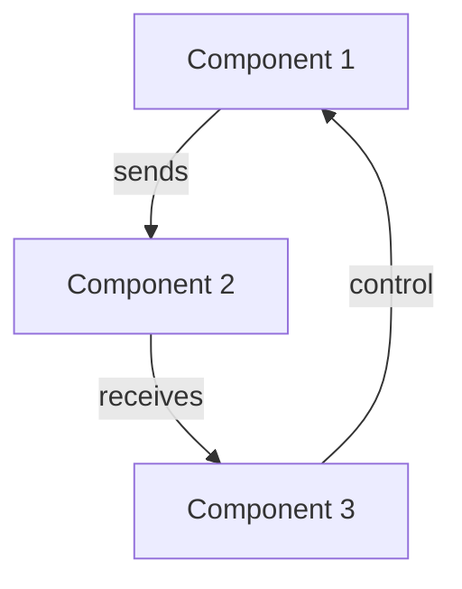

# Chapter Title

:::info Chapter Overview
- **Difficulty**: Beginner / Intermediate / Advanced
- **Time Required**: X-Y hours
- **Prerequisites**: [Link to prerequisite chapters if any]
- **Tools**: ROS 2, Python 3.10, VS Code
:::

## Learning Objectives

By the end of this chapter, you will be able to:

- [ ] Understand fundamental concept A
- [ ] Apply technique B to solve problems
- [ ] Build working example C
- [ ] Debug common issue D

## Introduction

**Why This Matters**: Explain the significance of this topic in the broader context of robotics and Physical AI.

**Real-World Application**: Provide a concrete example of where this is used in actual systems.

## Core Concepts

### Concept 1: Simple Explanation

**Definition**: Clear, concise definition suitable for beginners.

**Key Idea**: The most important thing to understand about this concept.

**Example**: Simple, concrete example.

```python
# Simple code example
def my_function():
    return "Hello, Robotics!"

result = my_function()
print(result)
```

**Visual Representation**: Describe a diagram or flowchart (see "Diagrams & Visualizations" section below).

### Concept 2: Intermediate Explanation

**Building On**: How this builds on Concept 1.

**Why It Matters**: Connection to real robotics systems.

**Code Example**:

```python
# More complex example showing the concept
class RobotController:
    def __init__(self, name):
        self.name = name

    def move(self, distance):
        print(f"{self.name} moved {distance} meters")

robot = RobotController("TurtleBot")
robot.move(1.5)
```

### Concept 3: Advanced Explanation (Optional)

**Deep Dive**: Deeper technical understanding for curious learners.

**Mathematical Foundation** (optional):

```text
Formula_if_needed = Related to practical application

**Advanced Techniques**:

```python
# Advanced implementation
class AdvancedRobotController(RobotController):
    def __init__(self, name, max_speed):
        super().__init__(name)
        self.max_speed = max_speed

    def move_safe(self, distance):
        if distance > self.max_speed:
            print(f"⚠️  Capping distance to {self.max_speed}")
        self.move(min(distance, self.max_speed))
```

## Hands-On Exercises

### Exercise 1: [Title]

**Goal**: What the student will accomplish.

**Prerequisites for This Exercise**: Any tools/setup needed.

**Step-by-Step Instructions**:

1. **Step 1**: Clear, actionable instruction
   - Sub-step a: Additional detail
   - Sub-step b: Another detail

2. **Step 2**: Next action
   - Code example if needed
   - Expected output

3. **Step 3**: Final step
   - Verification command
   - Expected result

**Expected Output**:

```
$ python solution.py
Output line 1
Output line 2
✅ Success!
```

**What You Learned**: Brief reflection on this exercise.

**Troubleshooting**:

| Problem | Solution |
|---------|----------|
| "Error XYZ" | Check that you did step 2 correctly |
| "Different output" | Verify your Python version with `python --version` |

---

### Exercise 2: [Title - More Complex]

**Goal**: Build on Exercise 1 with increased complexity.

**Prerequisites**: Must complete Exercise 1 first.

**Starting Code**:

```python
# Code template to get students started
def robot_task():
    # TODO: Implement this
    pass

if __name__ == "__main__":
    robot_task()
```

**Step-by-Step Instructions**:

1. **Initialize**: Set up workspace
2. **Implement**: Add your code
3. **Test**: Verify it works
4. **Debug**: Fix any issues

**Expected Output**:

```
$ python exercise2.py
[Expected output showing successful execution]
```

**Challenging Extension**: For advanced students:

- Try implementing with different parameters
- Optimize for performance
- Add error handling
- Extend functionality

**Common Mistakes**:

- ❌ Mistake 1: Explanation → ✅ Solution
- ❌ Mistake 2: Explanation → ✅ Solution

---

## Diagrams & Visualizations

### Diagram 1: [Title]

**Description**: What this diagram shows and why it's important.

```
[Textual representation of diagram or reference to image]
```

**Key Points**:
- Point 1: Explanation
- Point 2: Explanation
- Point 3: Explanation

### Diagram 2: [System Architecture]

**Description**: How components relate to each other.



**Explanation**: How data flows through the system.

---

## Code Examples

### Example 1: [Basic Implementation]

**What It Does**: Clear explanation of the code's purpose.

**Code**:

```python
#!/usr/bin/env python3
"""
Module docstring explaining what this code does.
"""

import sys
import os

class Example:
    """Class doing something useful for robotics."""

    def __init__(self):
        """Initialize the example."""
        self.count = 0

    def run(self):
        """Main execution method."""
        for i in range(5):
            self.count += 1
            print(f"Iteration {i}: {self.count}")

if __name__ == "__main__":
    example = Example()
    example.run()
```

**Key Points**:
- Line 1: Shebang for Python execution
- Lines 7-8: Class docstring
- Lines 10-12: Comments explaining key parts
- Lines 15-17: Main execution block

**How to Run**:

```bash
# Make executable
chmod +x example.py

# Run the script
python3 example.py

# Expected output
Iteration 0: 1
Iteration 1: 2
# ... etc
```

### Example 2: [Integration with ROS 2]

**What It Does**: How this connects to ROS 2 (if applicable).

```python
import rclpy
from rclpy.node import Node

class TurtleController(Node):
    """ROS 2 node for turtle control."""

    def __init__(self):
        super().__init__('turtle_controller')
        # Initialize node

if __name__ == '__main__':
    rclpy.init()
    # Create and run node
```

---

## Platform-Specific Notes

### Ubuntu 22.04

**Installation**:

```bash
sudo apt-get install package-name
```

**Common Issues**:
- Issue 1: Solution
- Issue 2: Solution

### Windows 10/11

**Installation**:

```powershell
# PowerShell command
choco install package-name
```

**Common Issues**:
- Issue 1: Solution
- Issue 2: Solution

### macOS 12+

**Installation**:

```bash
brew install package-name
```

**Common Issues**:
- Issue 1: Solution
- Issue 2: Solution

---

## Self-Assessment Checkpoint

Before moving to the next chapter, verify you can answer these questions:

1. **Definition Question**: What is [concept] and why is it important?
   - [ ] Can answer clearly
   - [ ] Partially understand
   - [ ] Need to review

2. **Application Question**: How would you use [technique] to solve [problem]?
   - [ ] Can explain with examples
   - [ ] Can explain generally
   - [ ] Unsure

3. **Code Question**: What does this code do? [Include code snippet]
   - [ ] Correct explanation
   - [ ] Mostly correct
   - [ ] Need more study

4. **Troubleshooting**: If you encounter error X, how would you fix it?
   - [ ] Know exact solution
   - [ ] Know general approach
   - [ ] Would need to look it up

5. **Project Question**: How would you build [project] using what you learned?
   - [ ] Clear plan for implementation
   - [ ] General idea of approach
   - [ ] Need to review chapter

**Scoring**:
- 5/5 "Can answer clearly": Ready for next chapter! 🎉
- 3-4: Review any weak areas before proceeding
- `<3:` Review the chapter material again

---

## Troubleshooting Guide

### Error: [Common Error 1]

**What It Means**: Explanation of what went wrong.

**Why It Happens**: Root cause explanation.

**How to Fix**:

```bash
# Step-by-step fix
step1
step2
# Should now work
```

**Prevention**: How to avoid this error in the future.

---

### Error: [Common Error 2]

**What It Means**: Another common error explanation.

**Debugging Steps**:

1. Check X with: `command`
2. Verify Y with: `command`
3. Look for Z in: `file_path`

**Solution**: Clear fix.

---

## Connections to Next Chapter

### What Comes Next

The next chapter builds on this by:
- Introducing more advanced concepts
- Adding new capabilities
- Integrating with other systems

### Preparation

To prepare for the next chapter:
- [ ] Complete all exercises in this chapter
- [ ] Review core concepts if needed
- [ ] Ensure your code runs without errors
- [ ] Experiment with extending examples

### Preview

In the next chapter, we'll learn about [topic] and build [project].

---

## References & Further Reading

### Official Documentation

- [Official Docs Link](https://example.com)
- [API Reference](https://example.com/api)
- [Tutorial Series](https://example.com/tutorials)

### Academic Papers

- Author, Year. "Title". *Publication*. [Link]
- Author, Year. "Title". *Publication*. [Link]

### Related Tutorials

- [External Tutorial 1](https://example.com)
- [External Tutorial 2](https://example.com)

### Glossary Terms

- **Term 1**: Definition with context
- **Term 2**: Definition with context
- (See full glossary in [Glossary](./glossary))

---

## Validation Checklist

Writers: Verify before submitting:

- [ ] All learning objectives are measurable
- [ ] Examples run successfully on Ubuntu, Windows, macOS
- [ ] Code includes comments explaining key points
- [ ] All diagrams have descriptive alt text
- [ ] Self-assessment checkpoint has 5+ questions
- [ ] Prerequisites clearly listed
- [ ] Time estimate accurate (test personally)
- [ ] No broken links to other chapters
- [ ] Troubleshooting covers the most common issues
- [ ] Tone is encouraging and accessible

---

**Chapter Status**: Draft / Ready for Review / Published

**Last Updated**: YYYY-MM-DD

**Maintained By**: [Author/Team Name]

**Questions?** Open an issue on [GitHub](https://github.com/physical-ai-lab/textbook/issues)

**Want to contribute?** See the contributing guidelines in the repository
